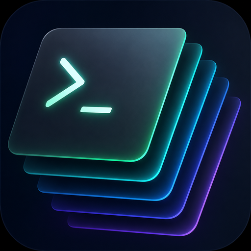
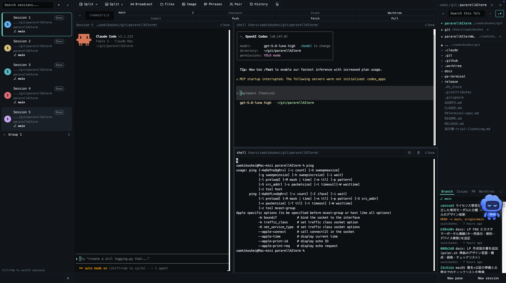
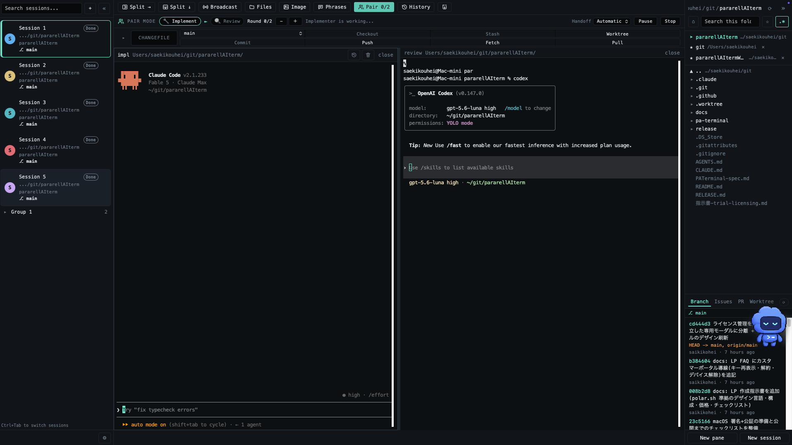
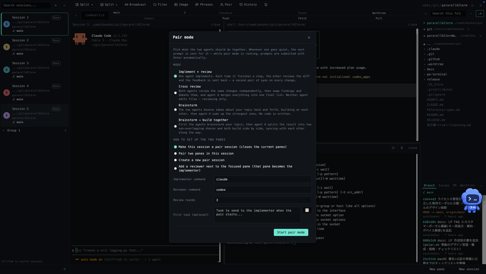
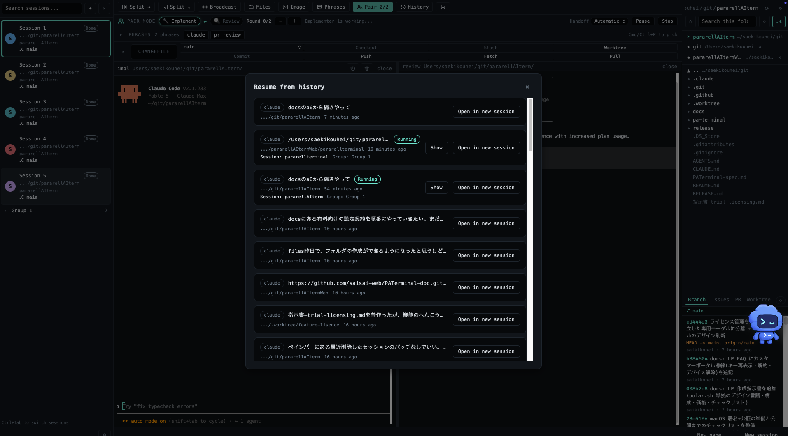
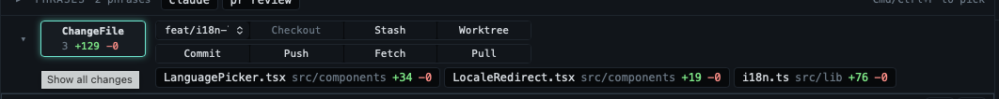
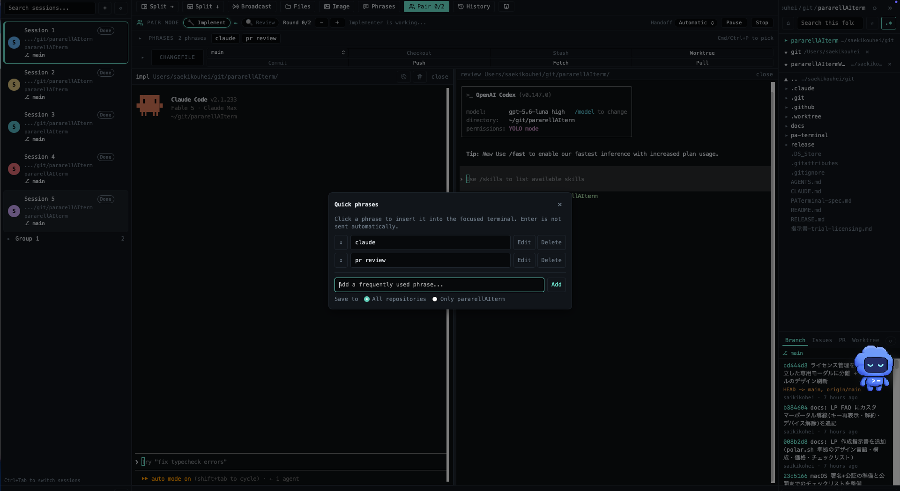
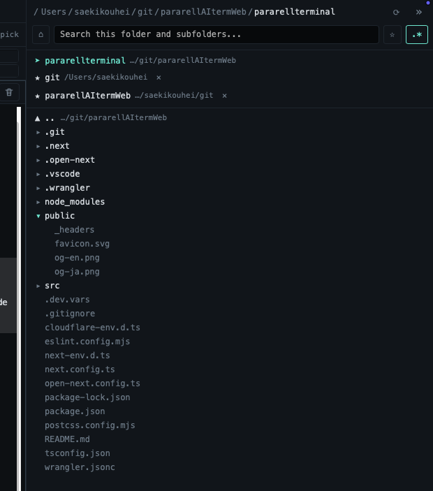
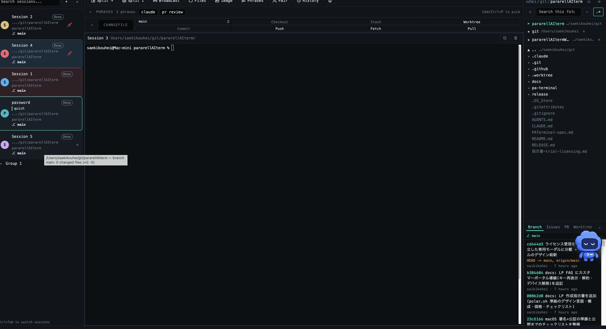
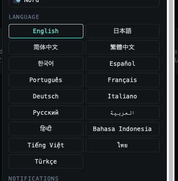

<div align="center">

<a href="https://paralellterminal.com">
  
</a>

<h1>PATerminal</h1>

**Run your AI agents in parallel.**

A multi-session desktop terminal built for Claude Code, Codex, and every CLI agent —
with Git, session resume, and agent pair-programming built in.

[](https://github.com/saisai-web/PATerminal/releases/latest)
[](https://github.com/saisai-web/PATerminal/releases/latest)
[](https://v2.tauri.app)
[](https://paralellterminal.com/pricing)
[](LICENSE.md)

[Website](https://paralellterminal.com) ·
[Pricing](https://paralellterminal.com/pricing) ·
[FAQ](https://paralellterminal.com/faq)

[](https://github.com/saisai-web/PATerminal/releases/latest/download/PATerminal-macOS-universal.dmg) [](https://github.com/saisai-web/PATerminal/releases/latest/download/PATerminal-Windows-x64-setup.exe)

<a href="https://paralellterminal.com">
  
</a>

</div>

## ✨ Highlights

Built for people who run more than one agent — everything you need to keep multiple
CLI agents working at once, without losing track of any of them.

- 🧵 **Parallel sessions** — each session is an independent pane tree. Group, pin, color-code, and annotate sessions; restart the app and everything comes back, scrollback included.
- 🤝 **Pair mode** — implement × review, cross-review, brainstorm, or build together: two agents pass prompts to each other automatically.
- 🔁 **Conversations survive restarts** — `claude` and `codex` are detected and reopened with `--resume`, and any past conversation can be handed to a fresh session.
- 🌿 **Git built in** — changes always visible above the terminal: commit, push, pull, branch, stash — plus PRs, issues, worktrees, and a diff viewer.
- 👀 **Live agent status** — running / waiting / done for every session, with desktop notifications for the ones you're not watching.
- 📣 **Broadcast & quick phrases** — type once, send to every session at the same time; keep your go-to prompts one click away.
- 🗂️ **File explorer** — file tree, recursive search, quick edits, trash-safe delete, and drag-and-drop moves, right next to your terminals.
- 🌐 **17 languages, 5 themes, zero telemetry** — no analytics, no tracking; everything you type stays on your machine.



## 🤝 Pair mode — two agents on one task

Put two agents on the same task and let them hand work to each other. In
*implement × review*, one agent implements and the other reviews every diff before the
feedback flows back — a second pair of eyes on every change. Handoffs are driven by the
agents' official completion signals (Claude Code's `Stop` hook, Codex's
`agent-turn-complete`), with a manual handoff button always available.



<details>
<summary><b>The four pair modes</b></summary>
<br>

1. **Implement × review** — one agent implements; each time it finishes a step, the other reviews the diff and the feedback is sent back.
2. **Cross review** — both agents review the same changes independently, swap findings and debate them, then one merges everything into a final list. Neither agent edits files.
3. **Brainstorm** — the agents bounce ideas about your topic back and forth ("yes, and…" or devil's-advocate style), then sum up the strongest ones.
4. **Brainstorm → build together** — after brainstorming, the work is split into two non-overlapping shares and both agents build side by side with sync points.



</details>

## 🔁 Conversations survive restarts

PATerminal detects `claude` and `codex` running in your panes. Quit the app, come back
tomorrow, and every session reopens its agent with `--resume` — the conversation picks up
right where it left off. The history picker lists your saved Claude Code and Codex
conversations, marks the ones still running, and can hand any of them to a new session in
the right directory.



## 🌿 Git, without leaving the terminal

Your changes are always visible in a strip above the terminal — per-file diffs one click
away, commit, checkout, push, fetch, pull, and stash built in. The Git panel adds commit
history with per-commit diffs, pull-request review threads, issues, and worktrees —
including *create a worktree from a pull request* and *start a session from an issue*.
(PRs and issues use your own authenticated `gh` CLI.)



## 📣 Broadcast input & quick phrases

Turn on broadcast and one keystroke stream reaches every selected session — with optional
auto-Enter for fire-and-forget prompts. Save the prompts you use every day as quick
phrases, global or per-repository, and insert them with one click or <kbd>⌘P</kbd>.
Enter is never sent automatically.



## 🗂️ Built-in file explorer

A file tree that follows the focused terminal's working directory. Search entire
subfolders, edit files in place with an unsaved-changes guard, preview images, keep
favorites — and deletes always go to the OS trash, never straight to oblivion.

<p align="center">
  
</p>

## 👀 Know what every agent is doing

Every session shows whether its agent is **running**, **waiting for input**, or **done** —
even for panes that aren't on screen, thanks to Rust-side detection that works without
rendering a single pixel. Sessions you're not looking at send a desktop notification the
moment they finish or need your approval.



## 🌐 17 languages · 5 themes · zero telemetry

The entire UI ships in 17 languages — English, 日本語, 简体中文, 繁體中文, 한국어,
Español, Português, Français, Deutsch, Italiano, Русский, العربية (full RTL), हिन्दी,
Bahasa Indonesia, Tiếng Việt, ไทย, Türkçe — and five themes: **Dark**, **Light**,
**Solarized Dark**, **Dracula**, and **Nord**.

And there is nothing to opt out of: PATerminal contains no telemetry, no analytics, and no
tracking. See the [privacy policy](https://paralellterminal.com/privacy).

<p align="center">
  
</p>

## 🧪 Free trial & licensing

PATerminal is proprietary **source-available** software — the source is public for
transparency, review, and personal builds, but it is *not* open source.

- **Official builds** — all features free for 30 days. Afterwards the app soft-locks:
  sessions, up to two panes per session, the file explorer, and everyday commits keep
  working for free, while splitting beyond two panes, broadcast, pair mode, quick
  phrases, conversation takeover, and the branch/issue/PR/worktree tabs require a
  [license](https://paralellterminal.com/pricing). Your data is never deleted.
- **Self-builds** — the EULA lets an individual build and modify the source for personal,
  non-commercial use. Self-built binaries have no trial and no lock: local features never
  expire.

The licensing is deliberately *not DRM*: no obfuscation, no anti-debugging, and every
check fails open — a validation failure or an offline stretch never takes features away
mid-work.

## ⚙️ Under the hood

- ⌨️ **Input you can trust.** The keyboard path is engineered around macOS WKWebView's
  event quirks (dropped `keypress`, key code 229, out-of-order `input` events) so fast
  typing never loses a character — the full engineering write-up ships in
  [CLAUDE.md](CLAUDE.md).
- 🚄 **Agents never block your typing.** PTY output is coalesced in Rust, and output from
  hidden panes is buffered natively (up to 2 MB per pane) without ever touching the UI
  thread until you look at it.
- 🪝 **Real completion signals.** Pair-mode handoffs use the agents' official hooks
  rather than guessing from output silence — and degrade gracefully to a manual button.
- 🔒 **Local-first.** All state lives in local JSON, Git and GitHub work runs through your
  own `git` and `gh`, and the only network calls are the update check and (in official
  builds) license validation.

## 🛠️ Building from source

Prerequisites: Node.js/npm, a current Rust toolchain, and the platform dependencies
required by [Tauri](https://v2.tauri.app/start/prerequisites/).

```sh
cd pa-terminal
npm ci
npm run check:architecture
npm run check:eula
npm run check:third-party-notices
npx tsc --noEmit
npm run test:ui:smoke
(cd src-tauri && cargo test)
npm run tauri dev
```

Self-built binaries are covered by the [EULA](LICENSE.md)'s personal, non-commercial
grant, never expire, and receive no code signing, notarization, auto-updates, or support.
See [pa-terminal/src/ARCHITECTURE.md](pa-terminal/src/ARCHITECTURE.md) for the frontend
module boundaries and [CONTRIBUTING.md](CONTRIBUTING.md) before opening an issue or pull
request.

## 🛡️ Security & contributions

Please report vulnerabilities privately as described in [SECURITY.md](SECURITY.md) —
reports are acknowledged within seven calendar days. Before opening an issue or pull
request, read [CONTRIBUTING.md](CONTRIBUTING.md).

## 📄 License

PATerminal is proprietary **source-available software, not open-source software**. The
EULA permits an individual to build and modify the PATerminal-authored source solely for
that individual's personal, non-commercial use. Commercial use, redistribution,
sublicensing, hosted offerings, and sharing official or modified builds require the
rights described in the EULA or prior written permission.

The English [PATerminal End User License Agreement v1.0](LICENSE.md) is the sole
authoritative text. Informational translations are available in
[`legal/eula/`](legal/eula/). Third-party components remain governed by their own
licenses, collected in [THIRD_PARTY_NOTICES.md](THIRD_PARTY_NOTICES.md).

---

<div align="center">
<sub>© 2026 PATerminal · <a href="https://paralellterminal.com">paralellterminal.com</a></sub>
</div>
